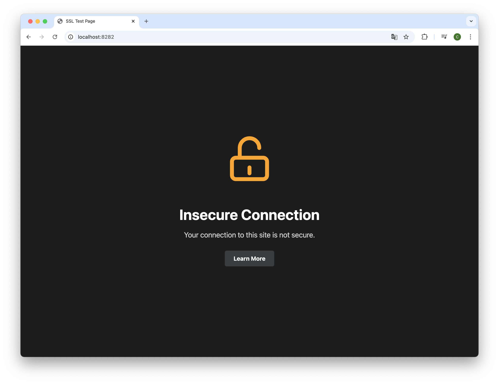
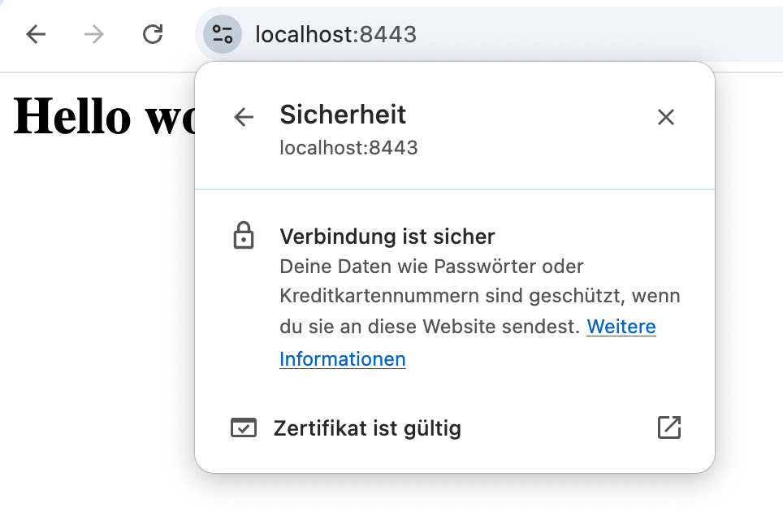
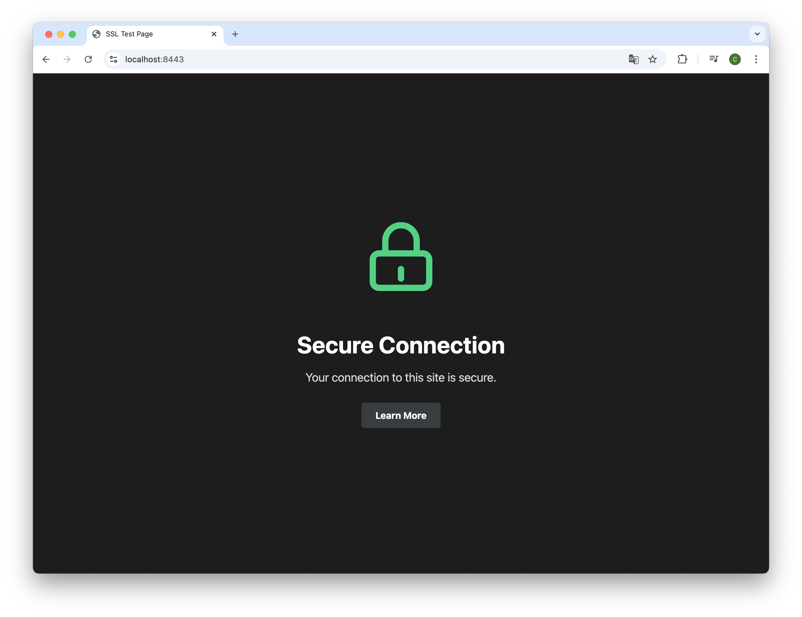

# Make Secure

This project is aimed to provide a simple wizard to secure a web server with TLS/SSL. The project is written in Deno and can be consumed as pre-complied binaries.
Make sure to execute the binaries matching your platform and processor architecture.

## Testing

The project is tested against a docker compose environment running apache2. The server will spin up without tls/ssl configuration and serve a basic web page available on http://127.0.0.1:8282. The server can be configured to use the provided certificate pair.

Generating a sample certificate pair can be done with the following command:

```bash
openssl req -x509 -newkey rsa:4096 -keyout demo-crt/key.pem -out demo-crt/cert.pem  -sha256 -days 3650 -nodes -subj "/C=DE/ST=Rhineland-Palatinate/L=SampleCity/O=SampleOrganization/CN=localhost" -addext "subjectAltName=DNS:localhost,DNS:*.localhost,IP:127.0.0.1"
```

We need to make sure [Subject Alternative Names](https://stackoverflow.com/a/66839523/13353068) are given. Despite that, browsers won't trust the certificate, because it was not issued by a trusted CA.

Thankfully, there is a simple way to make the browser trust self-signed certificates. The tool [mkcert](https://github.com/FiloSottile/mkcert) generates certificates signed by a locally trusted CA. Using this tool the browser won't show any warnings.

The following command will generate a certificate pair using mkcert for localhost:

```bash
mkcert -install # to make sure the locally trusted CA is installed
mkcert -key-file tests/demo-crt/key.pem -cert-file tests/demo-crt/cert.pem localhost 127.0.0.1 ::1 # generate a certificate pair for localhost
```

### About X.509 - Common file types


```plaintext
- .der -> binary encoded
- .pem -> base64 encoded
- .crt -> could be DER or PEM, means it is the public key (difference might not be clear by just checking file extension)
- .key / key.pem -> private key
```

[Read more at the Apache HTTP Server documentation](https://httpd.apache.org/docs/2.4/ssl/ssl_faq.html#aboutcerts).

# Running the cli

The interactive wizard can be started by running the following command:

```bash
make-secure
```

The script will guide you through the process of securing your web server. The following steps are executed:

- It will be verified the binary is executed in a linux environment with installed [apt package manager](https://manpages.ubuntu.com/manpages/xenial/man8/apt.8.html).
- The script will install testssl.sh as an automated test tool for the TLS/SSL configuration.
- You will be prompted to provide a publicly reachable domain name in order to check the webserver.
- A quick connection check on http/https will be performed. If the server is not reachable over https, this will be fixed later. If the server is not reachable over http, you probably have a configuration issue.
- Now, testssl.sh will run against the server. A brief summary about some key measures will be shown.
- You will be asked to provide the path to the certificate and key file. For my tests, I used the certificate pair generated by mkcert. Both files were in `.pem` format.
- You will be prompted which web server you are using. - Currently, only Apache is supported 😥 Feel free, to create a [PR](https://github.com/calvinrbnspiess/make-secure/pulls).
- The webserver configuration will be updated automatically. The server will be restarted.
- A connection check will be performed again. If the server is reachable over https, everything is fine. If not, something went horribly wrong.
- The script will run `testssl.sh` again to verify the configuration.

🎉 Yiiihaaa! Your server is now secured with TLS/SSL. 🎉

# Building binaries

```bash
deno run build
```

Binaries are stored in the `bin` directory. Go to: https://github.com/calvinrbnspiess/make-secure/tree/main/bin

# Running the tests

Make sure to have a deno runtime installed. You can look at the [official documentation](https://deno.land/manual/getting_started/installation) for more information.

Alternatively, you can run deno in a docker container: `docker-compose -f deno.docker-compose.yaml up -d` and `docker exec -it make-secure-dev-environment /bin/bash`. In the container you can now run deno with `deno run dev`.

To run a build and run the make-secure script, execute the following commands:

```bash
deno run build
docker compose -f tests/docker-compose.yaml down
docker compose -f tests/docker-compose.yaml up -d
docker exec tls-configurator-apache rm -rf /tmp/make-secure
docker exec tls-configurator-apache mkdir -p /tmp/make-secure
docker cp bin tls-configurator-apache:/tmp/make-secure
````
(this is the same as executing the `deployToDocker.sh` script)

You can enter the container using `docker exec -it tls-configurator-apache /bin/bash`.

Now you can run the compiled binary:

```bash
/tmp/make-secure/bin/linux/arm64/make-secure (on arm64 platform)
```

The certificate files inside `tests/demo-crt/` are mounted inside the container at `/usr/local/apache2/certificates/`.

When asked for the certificate path, provide `/usr/local/apache2/certificates/cert.pem`.
When asked for the key path, provide `/usr/local/apache2/certificates/key.pem`.

## Verification

The page should be reachable over HTTP at [http://localhost:8282](http://localhost:8282). Before running the tests, the server should not be reachable over HTTPS.



After running the wizard succesfully, the server should be reachable over HTTPS. Due to the local environment, the page is not reachable over default port `:80` and `:443`.

Thus, you can check the page at [https://localhost:8443](https://localhost:8443). The certificate should be trusted by the browser and the page should display a closed lock illustration.



The page should look like this:

